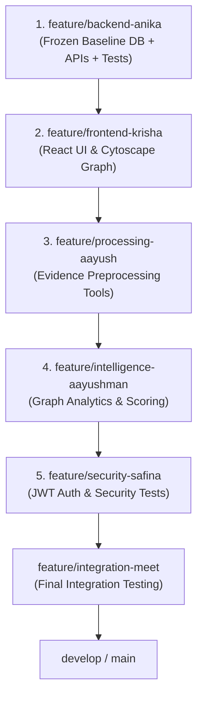

# Nexus SIH PS26189 — Meet's Integration & Demo Handoff Guide

**Role:** Integration Coordinator & Live Demonstration Lead  
**Assignee:** Meet  
**Primary Branch:** `feature/integration-meet`  
**Base Branches:** `develop` / `main`  
**Status Date:** 2026-09-06  

---

## 1. Role Overview & Objectives

As the Integration & Demonstration Lead, your mission is twofold:
1. **Branch Convergence:** Merge teammates' specialized feature branches into the integration branch (`feature/integration-meet`) and ultimately into `develop` without breaking the frozen Oracle XE schema, Alembic migration state (`e8f3b2c1d4a5`), or automated test suite (107/107 passing).
2. **Jury Demonstration:** Conduct the live evaluators' walkthrough, demonstrating real-time ingestion, conservative entity resolution, Louvain community clustering, deterministic grounded factor reasoning, and NCRB report generation.

---

## 2. Recommended Branch Merge Order

Merge feature branches in this strict sequence to prevent merge conflicts and regressions:



### Merge Verification Gate:
After merging each branch, execute:
```powershell
cd Nexus/backend
.\venv\Scripts\python.exe -m unittest discover tests
```
All 107 tests must pass before proceeding to the next merge.

---

## 3. Demo Environment Verification (T-Minus 15 Minutes)

Execute this PowerShell command to confirm database connectivity and data integrity:

```powershell
cd Nexus/backend
.\venv\Scripts\python.exe -c "
from app.database.connection import SessionLocal
from app.models import FIR, Evidence, Entity, Relationship, Alert, Report
from sqlalchemy import func, select

db = SessionLocal()
print('=== NEXUS SYSTEM INTEGRITY CHECK ===')
print('FIR Records (544):', db.scalar(select(func.count(FIR.id))))
print('Evidence Records (544):', db.scalar(select(func.count(Evidence.id))))
print('Canonical Entities (804):', db.scalar(select(func.count(Entity.id))))
print('Relationships (905):', db.scalar(select(func.count(Relationship.id))))
print('Active Alerts (6):', db.scalar(select(func.count(Alert.id))))
print('Executive Reports (1+):', db.scalar(select(func.count(Report.id))))
db.close()
"
```

---

## 4. System Launch Procedure

### Terminal 1: Backend API Service
```powershell
cd Nexus/backend
.\venv\Scripts\activate
uvicorn app.main:app --host 0.0.0.0 --port 8000 --reload
```
*Health Check:* Open `http://localhost:8000/health` (returns `{"status":"healthy"}`).  
*Interactive Docs:* Open `http://localhost:8000/docs`.

### Terminal 2: Frontend Dashboard (Krisha)
```powershell
cd Nexus/frontend
npm install
npm run dev
```
*Dashboard Access:* Open `http://localhost:5173`.

---

## 5. Structured 3-Minute Jury Pitch & Live Flow

### Minute 1: Problem Statement & Evidence Grounding
- **Theme:** "From Raw Scans to Admissible Evidence"
- **Talking Points:**
  - Introduce PS 26189: AI-Powered Criminal Network Analysis for NCRB / MHA Women Safety Division.
  - Show the 544 real-world police FIR scans ingested from the ICDAR 2023 dataset.
  - Highlight the conservative entity resolution: same-FIR mentions are deduplicated, but identical names across different FIRs are deliberately preserved as distinct nodes (`KEPT_SEPARATE_CROSS_FIR`) to uphold Indian evidentiary standards and prevent false criminal linking.

### Minute 2: Graph Intelligence & Syndicate Detection
- **Theme:** "Uncovering Hidden Syndicates via Graph Analytics"
- **Talking Points:**
  - Navigate to the Cytoscape graph visualization (`GET /api/intelligence/graph/21`).
  - Demonstrate Louvain community detection (354 communities detected across 804 nodes and 905 relationships).
  - Highlight **Community 92** and **Community 3** cluster alerts: coordinated syndicates operating across multiple jurisdictions and statutes.

### Minute 3: Explainability & Executive Action
- **Theme:** "Trustworthy AI with Zero Hallucination"
- **Talking Points:**
  - Click on high-risk entity (e.g., Entity ID 47).
  - Show the grounded factor explanation (`POST /api/intelligence/explain/47`): degree centrality, statutory co-occurrences, and community risk score—completely deterministic, zero hallucination.
  - Trigger one-click executive intelligence report generation (`POST /api/reports/generate/21`).

---

## 6. Evaluator Q&A Prepared Responses

| Potential Jury Question | Recommended Technical Response |
| :--- | :--- |
| *"Why didn't you merge all people with the same name across FIRs?"* | "Under Indian Evidence Law, common names cannot be linked across cases without unique identifiers (Aadhaar/PAN/Voter ID). Doing so causes dangerous false positives in criminal records. Our system deliberately flags potential matches without corrupting the canonical graph." |
| *"Is your explanation powered by ChatGPT / an LLM?"* | "Our core explanation engine is deterministic and factor-grounded to ensure 100% evidentiary admissibility and zero hallucination for court presentation. It computes exact graph centrality metrics and statutory co-occurrence trails." |
| *"What happens if you re-run the analysis?"* | "The entire pipeline is idempotent and transactionally safe. A re-run produces zero duplicate relationships, analyses, or alerts." |
